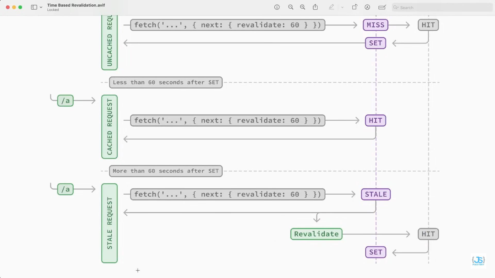

# Introduction

    Welcome to Mango. This is where your next journey starts^^
    We connect developers around the world, main South Australia, in search for
    the next collaboration!

## Tech Stack

1. Nextjs
2. TypeScript
3. Tailwindcss
4. Auth.js -> GitHub Oath
5. Shadcn UI
6. Sanity
   -> Database Management
   -> Query Language (GROQ)
   -> Live API Content

### NOTE

1. Modify pre-defined tailwinds class in /app/global.css
2. Why writing code to the page.tsx ? -> PPR: server + client side rendering
3. Most of the components are server-side-rendering (SSR) -> except /components/SearchFormReset.tsx

4. Dataset being used: _mango_ -> might need to change to production

5. Documents (authors, projects, ...) are tracked using sanity type gen
   -> extract schema author.ts and project.ts
   -> If not able to extract -> _npm install lucide-react@0.469.0_ or lucide-react@latest --legacy-peer-deps (React19 is crazy)

6. Clients only able to write to _dataset_ using Sanity API Tokens

7. _Project page_ use client.fetch()
   -> useCdn = true -> allow caching for static part
   -> we use writeClient() for _Views_ part -> useCdn = false -> Dynamic!

   The project page use Incremental Static Regeneration (ISR)
   -> Revalidate the page every 60s
   -> Any update from database is delivered when cache is refreshed
   The View button use SSR

8. User when logged in with GitHub
   -> Check if the user already registerd as an author in Sanity database
   -> By fetch a sanity query to check with that specific GitHub ID
   -> If not -> writeClient() as happening in the background

9. Project Form Submission Handling 
   -> It validates the form with a form schema (using validation.ts)
   -> if fail, it reset the form
   -> Identify if a _z error_ or just a normal error

#### BUG TO BE FIXED

1. MIGHT NEED TO DOWNGRADE TO REACT18 BC SANITY NOT FULLY SUPPORT REACT19 YET
2. **PROJECT_ID AND DATASET** is set as environment var on Vercel
   -> Might need to change as it might be vulnerable

# (^.^)> New Things I Learnt!

1. Sanity allow caching -> if < ${revalidate} ? use from cache : get from data source
   -> Demonstration: 
2. Fetching using client.fetch()
3. Understanding Partial Pre-rendering (PPR) and SSR

# ^(>.<)^ IMPLEMENT LATER!

1. Github login for now -> Google login later
2. Change localhost to vercel link later in the github Oauth setting
3. Change favicon.icon to our logo later
4. Change StartupCard to ProjectCard
5. Create a function formatView() in /lib/utils.ts to check if view is plural or singular
6. Increase view whenever someone visits the project page
